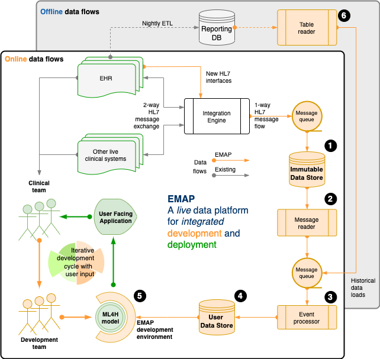

# Figures

## Figure 1: Real-world development

Our real-world development is performed on the  Experimental Medicine Application Platform (EMAP). EMAP is a clinical laboratory within which ML4H researchers can iteratively build, test and gather feedback from the bedside. It unifies the data and the tools for off-line and online development of ML4H models. In brief, EMAP builds a patient orientated SQL database from Health Level 7 version 2 (HL7v2) messages that are being exchanged between hospital systems. HL7v2 messages are ubiquitous in health care, and the *de facto* standard for internal communication.

Rather than multiple pairwise connections between different hospital electronic systems, an integration engine acts as a single hub that routes HL7 messages, and where necessary translates to ensure compatibility. EMAP copies each message passing through the integration engine to a PostgreSQL database, the *Immutable Data Store (IDS)* (see Figure 1 and the \[numbers\] in the following sentences that refer to objects in the figure). A *message reader*\[2\] processes each live message to an interchange format so that downstream processing is insulated from local HL7 implementation. Separately, the *table reader*\[5\] processes historical data (e.g. from the reporting database) to the same interchange format. Live messages take priority over historical messages in a queue that feeds the *event processor*\[3\]. This links each message to a patient and a hospital visit, makes appropriate updates for out of order messages, and merges when separate identifiers are recognised to represent the same patient. A full audit trail is maintained. Each event updates a second live PostgreSQL database, the *User Data Store (UDS)*\[4\].
The hospital hosts Jupyter and RStudio servers, and a Linux development environment is provided that allows docker deployment, installation of analysis libraries and frameworks, exposes SSH and HTTPS services, and allows user verification against the hospital active directory.\[5\]\
A typical workflow might include investigation and experimentation in a Jupyter Notebook with data from the UDS, then using a small network of docker containers to run the development script, log outputs to a testing database, and report to users via email or a locally hosted web application or dashboard.
A fuller explanation is available in the Electronic Supplementary Material [Section 2: EMAP data flows]().

## Figure 2: ML-Ops

Our ML-Ops platform is called FlowEHR. Moving from left to right across the figure, the system monitors raw input data including checks for distribution shift, builds features with testable and quality controlled code, makes those features available to for both training and predictions to avoid train/serve skew, and maintains an auditable and monitored model repository.

